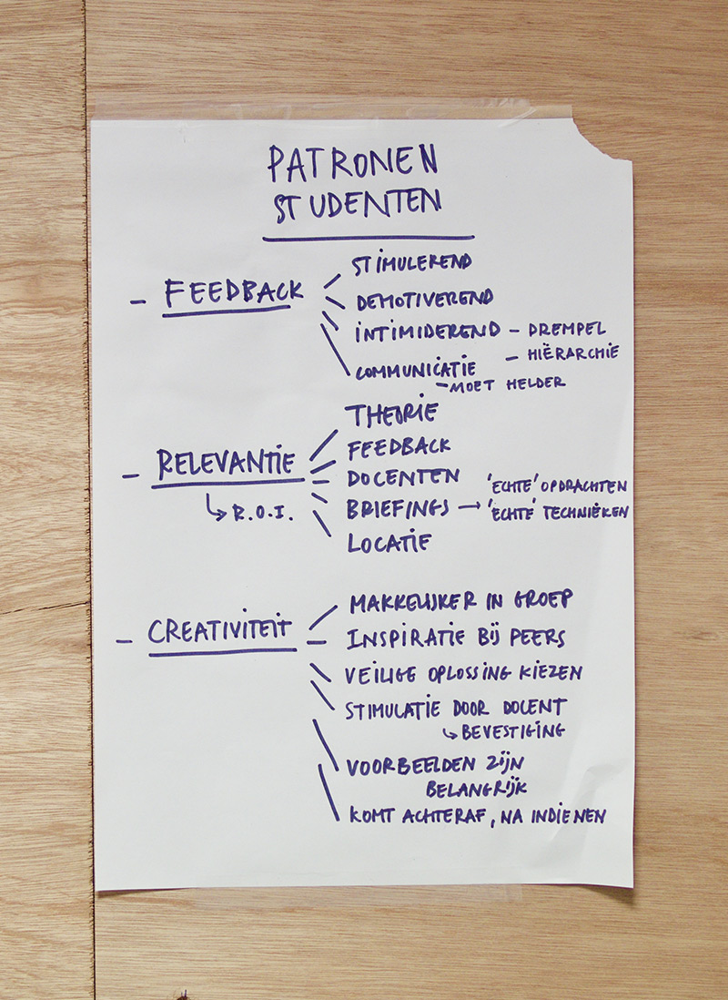

## Inzichten uit empathy map 2de/3de jaar

### Angst
- Angst voor feedback is minder maar voelt nog steeds niet goed.
- Studenten gaan vaak nog steeds niet op feedback omwille van angst.

### Creativiteit
- “Doe-maar mentaliteit” in een specifieke afstudeerrichting remt creativiteit, student voelt zich op een eiland, dat werkt blokkerend.
- Inspiratie bij peers, creatieve ideeën komen gemakkelijker in groep.
- Geen tijd om te falen, studenten kiezen 'veilige' oplossingen.
- Stimulatie van creativiteit door bevestiging van docent
- Creativiteit komt niet vanzelf
- Onderzoek/inspiratie = pinterest
- Niet creatief door voorgekauwde briefings
- Beste ideeën komen achteraf

### Feedback
- Destructief, sommige studenten stoppen.
- Geen tijd om te falen
- Moeilijk om feedback correct te interpreteren
- Negatieve feedback wordt wel aanvaard van docent met vakkennis
- Goede voorbeelden van docenten helpen
- Communicatie en golflengte met docenten/ Opdrachten
- Aanspreken docenten met voornaam verlaagt de drempel

