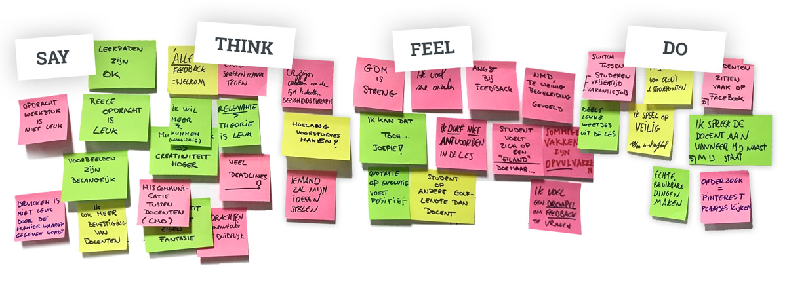
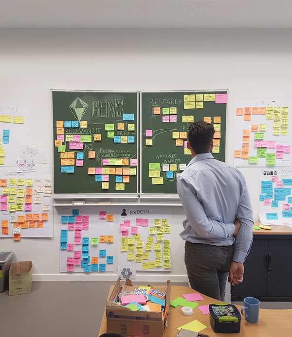

## Methodes kwalitatief onderzoek

    

    <h2>Empathy maps opstellen met input van eerste-, tweede- en derdejaarsstudent</h2>
    
    
De 'Empathy Map' is een concept dat ons helpt om dieper inzicht te krijgen in de belevingswereld van de studenten. Wanneer de Empathy Map met de juiste informatie wordt gevuld, stelt het ons in staat om betere waardeproposities te maken, betere manieren te vinden om studenten te bereiken en een effectievere 'customer relationship' met onze studenten op te bouwen.

    <h3>Het invullen van de Empathy Map deden we aan de hand van vier vragen.</h3> 

    <h4>Vraag 1: wat denkt en voelt de student?</h4>
    
Bij het schetsen van de mening van de student ga je dieper in op wat de student denkt en voelt. Je probeert dit te achterhalen door een zo breed mogelijke vraagstelling zodat antwoorden spontaan komen en niet (onbewust) door de interviewer gestuurd worden.

    <strong>Denk aan vragen als</strong>
    <ul>
    <li>wat beweegt de student?</li>
    <li>welke emoties voelt de student?</li>
    </ul>

    <h4>Vraag 2: wat hoort de student?</h4>
    
Wat de student hoort heeft betrekking op de invloed die de omgeving heeft op de student.

    <strong>Denk aan vragen als</strong>
    <ul>
    <li>welke kanalen zijn invloedrijk?</li>
    <li>door wie wordt de student werkelijk beïnvloed?</li>
    <li>in welke mate luistert de student naar wat een vriend/vriendin zegt?</li>
    </ul>

    <h4>Vraag 3: wat ziet de student?</h4>

    
Bij het achterhalen wat de student ziet, wordt het milieu waarin de student leeft onder de loep genomen.

    <strong>Denk aan vragen als</strong>
    <ul>
    <li>door wie wordt de student omringd?</li>
    <li>wie zijn de vrienden van de student?</li>
    <li>aan welke invloeden wordt de student blootgesteld</li>
    </ul>

    <h4>Vraag 4: wat zegt en doet de student?</h4>

    
Naast het achterhalen van gedachten en gevoelens, dien je ook inzicht te verwerven in wat de student zegt en doet.

    <strong>Denk na over vragen als:</strong>
    <ul>
    <li>wat zou de student kunnen vertellen aan anderen?</li>
    <li>welke houding zou de student kunnen aannemen?</li>
    <li>hoe zou de student zich in het publiek kunnen gedragen?</li>
    <li>Van belang bij deze vraag is ook om te achterhalen waar de spanning zit tussen wat een klant zegt en doet en wat deze klant denkt en voelt.</li>
    </ul>

    

    
    

    <h2>Gems</h2>
    
De uitkomsten van de interviews die het team organiseerde met stakeholders van de opleiding (werkveld, collega's en studenten) werden gegroepeerd volgens thema (waar mogelijk). Het werd al snel duidelijk dat een aantal thema's meer 'gewicht' hadden dan andere. Die thema's omschrijven we als 'gems'. 

    

   

    

