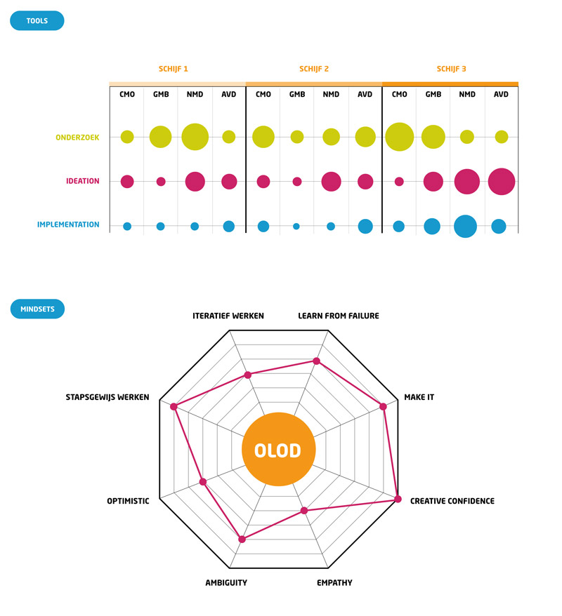

## Kwantitatief onderzoek

    

        <h2>HCD Scan</h2>
        
        
Het is belangrijk om inzicht te krijgen in hoeverre de Human Centered Design mindsets en tools reeds aanwezig binnen de opeleiding. Daarnaast willen we ook te weten komen waar die aanwezige mindsets en tools zitten. Hiervoor werd een bevraging gedaan bij de verantwoordelijken van elk OLOD, aan de hand van een online vragenlijst.

        <h3>De vragen</h3> 
        
Link google drive

        

    
    

        <h2>Analyse data</h2>
        
De data die gewonnen werd uit de bevraging wordt verwerkt in functie van visuele output.

        
    

