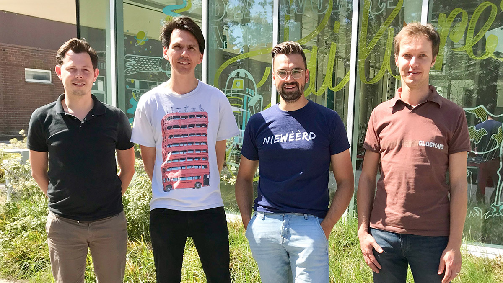

<section class="features">
	<article>
		
		

			<h3>Dieter Wullaert</h3>
			
Nieuwsgierige ontstaansbegrijper. Vaak op zoek naar oorzaken en drijfveren om te achterhalen waarom dingen werken of niet, waarom mensen doen wat ze doen of niet doen. Als “design researcher” hou ik ervan om oplossingen op maat te bedenken en producten en diensten te ontwikkelen die echt werken.

		

	</article>
	<article>
		
		

			<h3>Jonas Pottie</h3>
			
Docent, coördinator, grafisch ontwerper en UX designer met een groot probleemoplossend vermogen. Is vrijwel in alles geïnteresseerd.

		

	</article>
	<article>
		
		

			<h3>Stijn Anseel</h3>
			
Lector en zelfstandig grafisch vormgever met een digitale mindset. Gepassioneerd door vormgeving, in de breedste zin van het woord, en haar inzetbaarheid als tool om betekenisvolle oplossingen te kunnen formuleren voor problemen waar mensen in deze pijlsnel evoluerende wereld mee geconfronteerd worden.

		

	</article>
	<article>
		
		

			<h3>Dieter De Weirdt</h3>
			
<abbr title="User Interface">UI</abbr>, <abbr title="User Experience">UX</abbr>, <abbr title="Human Centered Design">HCD</abbr>, ... zijn nog maar enkele van mijn vele interesses, ik ben vooral een doener en maker maar hou hierbij steeds rekening met de eindgebruiker.

		

	</article>
</section>

